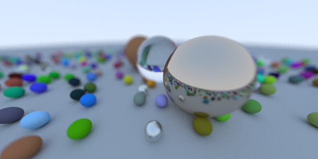

# raytracer3
Based on the book "[Ray Tracing In One Weekend](https://www.amazon.com/gp/product/B01B5AODD8/)"

This is a pretty standard path tracer, built mostly to experiment with the Rayon multithreading library.

# Examples

